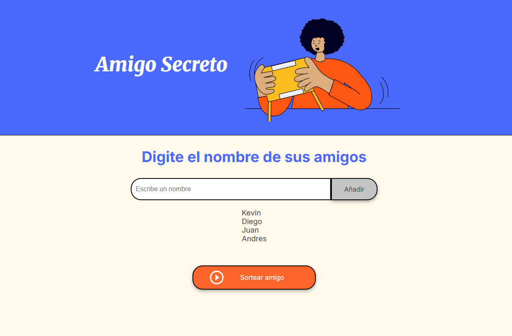
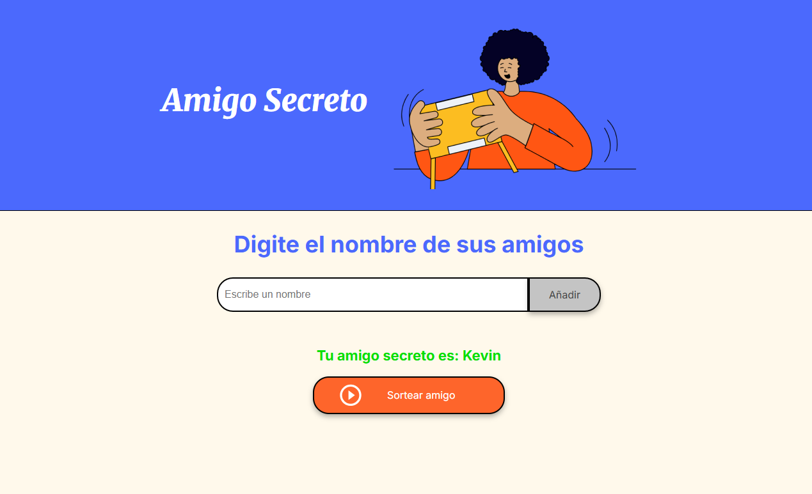

# Amigo Secreto

Este proyecto es una aplicación web para sortear amigos secretos. El principal objetivo de este desafío es fortalecer tus habilidades en lógica de programación.

## Estructura del Proyecto

El proyecto está compuesto por los siguientes archivos y directorios:

- `index.html`: Contiene la estructura HTML de la aplicación.
- `style.css`: Contiene los estilos CSS para la aplicación.
- `app.js`: Contiene la lógica de programación en JavaScript.
- `assets/`: Directorio que contiene las imágenes utilizadas en la aplicación.

## Funcionalidades

- Añadir amigos a una lista.
- Sortear un amigo secreto de la lista de amigos.
- Mostrar el resultado del sorteo.

## Cómo usar

1. Clona este repositorio en tu máquina local.
    ```sh
    git clone https://github.com/tu-usuario/amigo-secreto.git
    ```
2. Abre el archivo `index.html` en tu navegador web.
3. Ingresa los nombres de tus amigos en el campo de texto y haz clic en "Añadir".
4. Una vez que hayas añadido al menos dos amigos, haz clic en el botón "Sortear amigo" para realizar el sorteo.
5. El resultado del sorteo se mostrará en la pantalla.

### Ejemplo de uso

#### Lista de amigos



#### Sorteo del amigo secreto




## Tecnologías Utilizadas

- HTML
- CSS
- JavaScript

## Contribuciones

Las contribuciones son bienvenidas. Si deseas contribuir, por favor sigue los siguientes pasos:

1. Haz un fork del proyecto.
2. Crea una nueva rama (`git checkout -b feature/nueva-funcionalidad`).
3. Realiza tus cambios y haz commit (`git commit -am 'Añadir nueva funcionalidad'`).
4. Haz push a la rama (`git push origin feature/nueva-funcionalidad`).
5. Abre un Pull Request.


## Autor

Este proyecto fue desarrollado por ShadowJr33 como parte de un desafío de programación para fortalecer habilidades en lógica de programación.
